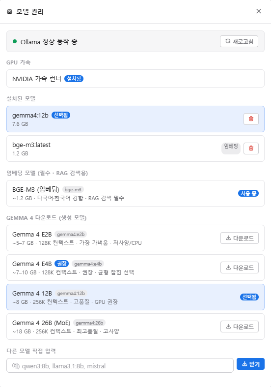
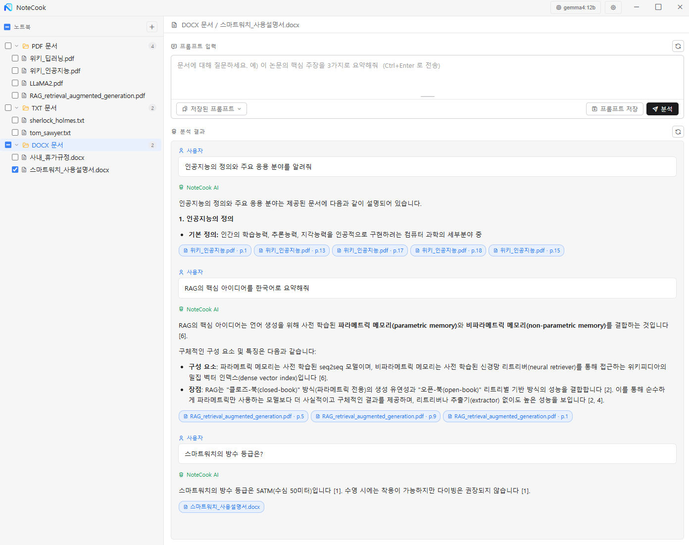
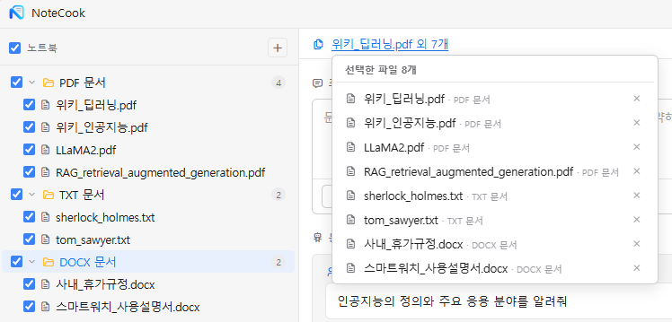
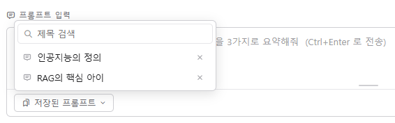

# NoteCook

## 1. 앱 설명

**나만의 문서 자료를 분류하여 오프라인 환경에서 AI로 분석하는 데스크톱 앱**입니다.
(Google NotebookLM 스타일의 로컬·오프라인 버전)

- PDF / DOCX / HWPX(한글) / TXT / Markdown 문서를 노트북 단위로 분류·관리합니다.
- 로컬 LLM(**Gemma 4 via Ollama**)으로 문서에 대해 질의응답하며, 답변에 **출처(문서·페이지)를 인용**합니다.
- 임베딩 → 청킹 → 코사인 유사도 검색(RAG)을 **numpy 기반**으로 구현해 별도 벡터DB·검색엔진이 필요 없습니다.
- 최초 1회 모델 다운로드 이후에는 **네트워크 없이 완전 오프라인**으로 동작합니다.
- 문서 인덱스·라이브러리는 `%LOCALAPPDATA%\NoteCook\data` 에 저장됩니다 (`library.json`, `index/<doc_id>.json`).

## 2. 기술 스택

| 구분 | 사용 기술 |
| --- | --- |
| 셸 / UI | Python + [pywebview](https://pywebview.flowrl.com/) (Windows WebView2), HTML/CSS/JS |
| 백엔드 / RAG | Python (JS ↔ Python 브리지 `window.pywebview.api`) |
| 문서 파싱 | `pypdf` (PDF), `python-docx` (DOCX), 표준 ZIP/XML (HWPX), 내장 텍스트 (TXT/MD) |
| 벡터 검색 | `numpy` 코사인 유사도 벡터화 + 인덱스 메모리 캐시 (별도 벡터DB·검색엔진 없이 JSON 인덱스 + 직접 계산) |
| LLM 런타임 | [Ollama](https://ollama.com/) (`localhost:11434`) — 질의 전 모델 워밍업(콜드 로드 시 빈 응답 방지) |
| 생성 모델 | Gemma 4 (E2B / E4B / 12B / 26B 선택 다운로드) |
| 임베딩 모델 | BGE-M3 (다국어·한국어 강함, RAG 검색 필수) |
| 패키징 / 배포 | PyInstaller(onedir) + Inno Setup per-user Setup.exe + Ollama 런타임 번들 + GPU 런너 자동 다운로드 |

## 3. 화면별 설명

### AI 모델 설정

Ollama 동작 상태와 GPU 가속 런너 설치 여부를 확인합니다. 설치된 모델 목록을 관리하고,
생성 모델(Gemma 4 E2B/E4B/12B/26B)과 임베딩 모델(BGE-M3)을 선택해 다운로드합니다.
`다른 모델 직접 입력` 으로 임의 Ollama 모델(예: qwen3:8b)도 받아 쓸 수 있습니다.

### 질의 응답

프롬프트를 입력하면 선택된 문서를 RAG로 검색해 답변을 생성합니다.
각 답변에는 근거가 된 **문서명과 페이지 번호가 인용 칩**으로 함께 표시됩니다.

### 검색할 문서 선택

좌측 노트북 트리에서 PDF/DOCX/HWPX/TXT 문서를 폴더 또는 개별 단위로 선택해
질의응답의 검색 범위를 지정합니다. 선택한 파일 목록을 한눈에 확인할 수 있습니다.

### 입력한 프롬프트 저장

자주 쓰는 프롬프트를 제목과 내용으로 저장합니다.

### 저장된 프롬프트 선택

저장해 둔 프롬프트를 제목으로 검색·선택해 입력창에 바로 불러옵니다.
